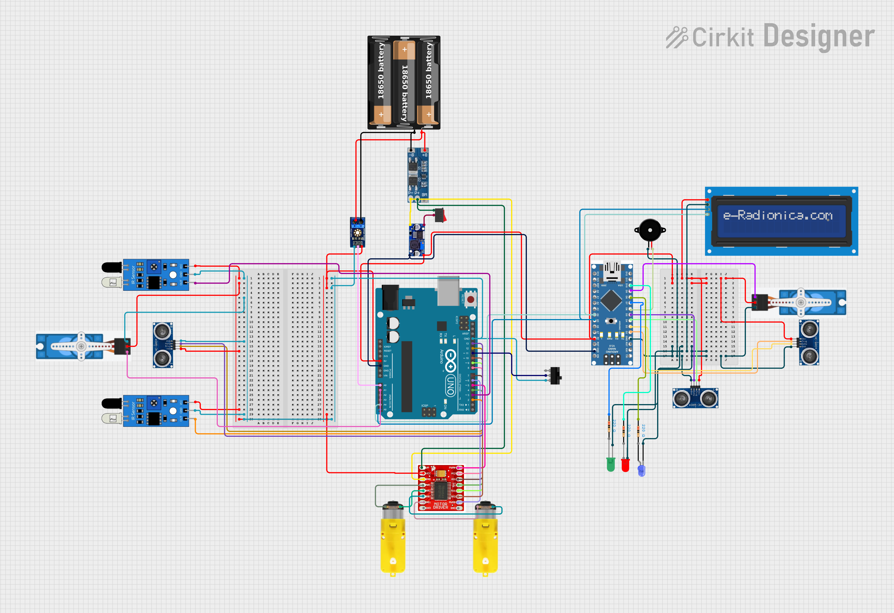

  

<h1 align="center">Smart Mobile Trash Bin Robot</h1>

Autonomous mobile waste collection robot with dual navigation modes and automatic lid system

---

## Project Overview

The Smart Mobile Trash Bin Robot is an autonomous robotics system designed to improve waste management in indoor environments such as university canteens, corridors, and public areas.

In many crowded environments, trash bins are placed only in fixed locations. People often leave waste on tables or floors instead of walking to the bin. This project introduces a mobile trash bin robot that moves around the environment, making waste disposal easier and reducing litter.

The robot navigates using two different movement modes and automatically opens the lid when a user approaches the bin.

---

## Project Demo

Watch the project demonstration video.

https://www.youtube.com/watch?v=YOUR_VIDEO_ID

You can also display the video with a clickable thumbnail.

---

## System Architecture

The system uses an Arduino based control system connected to sensors, motors, and user interface components.

  

Main modules of the system

• Arduino UNO microcontroller  
• Motor driver for robot movement  
• Ultrasonic sensors for detection  
• Line tracking sensors  
• Servo motor for lid mechanism  
• LCD display for system status  
• Battery power system  

---

## Navigation Modes

### Line Following Mode

The robot follows a predefined black line path placed on the floor. This mode is suitable for structured environments where the robot needs to follow a specific route.

### Random Obstacle Avoidance Mode

The robot moves freely and uses an ultrasonic sensor to detect obstacles. When an obstacle is detected, the robot changes direction and continues moving.

---

## Sensors Used

### Ultrasonic Sensor (HC-SR04)

This sensor measures distance using ultrasonic waves.

Functions

• Detect user hand near the bin  
• Detect obstacles during movement  
• Measure trash level inside the bin  

---

### IR Line Sensors

Infrared sensors detect the black line on the floor.

Functions

• Enable line following navigation  
• Keep the robot on the correct path  

---

### Servo Motor (Lid Control)

A servo motor controls the trash bin lid.

Functions

• Automatically open the lid when a user is detected  
• Close the lid after a few seconds  

---

## Hardware Components

Main components used in this project

Arduino UNO  
Arduino Nano  
Ultrasonic Sensors  
IR Line Sensors  
Servo Motor  
LCD Display with I2C module  
TB6612FNG Motor Driver  
DC Geared Motors  
LED indicators  
Buzzer  
18650 Battery pack  
5V Buck Converter  
Robot chassis with wheels  

---

## Circuit Diagram

The circuit connects sensors, motors, and display modules to the Arduino controller.

  

---

## Working Process

1. Robot powers on  
2. Navigation mode is selected using the switch  
3. Robot starts moving  
4. Sensors continuously monitor the environment  
5. If a user is detected near the bin  
6. Robot stops  
7. Lid opens automatically  
8. User disposes waste  
9. Lid closes after a short delay  
10. Robot continues navigation  

---

## Project Structure
